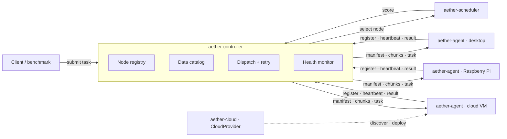

# AetherMesh

**Stop shipping gigabytes to your compute. Ship the compute instead.**

AetherMesh is a Rust layer that sits *on top of* whatever you already run — AWS, GCP, Azure, a VPS, bare metal, the desktop under your desk, a Raspberry Pi — and decides **where each task should run and how few bytes have to move to get it done**.

In a 100-task benchmark over a shared 8 MiB dataset, that decision is worth **99.9 % less traffic** ([how this is measured](#benchmarks)).

[](https://www.rust-lang.org)
[](#license)
[](#contributing)
[](#project-status)

---

## The idea

Distributed systems move data to the machine that runs the code. When the data is large and the link is slow, that movement *is* the job's cost — everything else is rounding error.

AetherMesh inverts the default:

```
move data to the compute
        ↓  only when that is actually cheaper
move the compute to the data
```

Four things follow from that principle, and they are what this project is:

| | |
|---|---|
| **Compute optimization** | pick the node by score, not by round-robin |
| **Data locality** | know which node already holds which dataset |
| **Transfer optimization** | content addressing, chunk-level dedup, adaptive compression |
| **Distributed runtime** | registry, heartbeats, dispatch, retries, results |

---

## What makes it different

### Data crosses the wire once

Every dataset is identified by its **BLAKE3 hash**. The controller tracks which node holds what, so a dataset read by a hundred tasks is transferred **once**. Large datasets are split into content-addressed chunks, and a chunk the receiver has already seen — from this dataset or any other — is never sent again.

### Compression is a decision, not a reflex

Payloads under 4 KiB go raw. Links faster than ~800 Mbps are left alone, because there the CPU costs more than the bytes. LZ4 output is kept only if it actually saves ≥ 5 %. Random data does not get pushed through a compressor for nothing.

### A scheduler you can read and tune

```
score = compute_cost + transfer_cost + latency_penalty − locality_bonus
```

Lower wins. Every weight is configurable and the score comes back term by term, so you can see *why* a node was chosen. Three policies ship: `LeastLoadedScheduler`, `LocalityScheduler`, `AdvancedScheduler`.

### Failures are ordinary

Heartbeats stop → the node is evicted and its data locations are forgotten. A node refuses a task → the task is re-dispatched to the next best node, data and all. A task that *ran* and failed is returned as a result, not retried forever.

### Tasks carry data, never code

A task names a built-in operation (`echo`, `hash`, `cpu`) plus an opaque payload. Arbitrary code is never shipped to a node; unknown task kinds come back as a failed result, not as an execution and not as a panic.

---

## Project status

**Alpha — all 20 planned phases are implemented, covered by 173 tests, and not yet battle-tested.**

Working today: core types, wire protocol, node registry, metrics collection, three schedulers, TCP transport with optional TLS, token authentication, persistent node identity, remote execution of built-in tasks, content-addressed and chunked transfer with dedup, adaptive compression, retries and heartbeat eviction, TOML configuration, counters and structured logs, a cloud-provider seam, and a benchmark harness with baseline comparison.

Honest gaps, all of them tracked below in [Roadmap](#roadmap):

- No task submission CLI — you submit through the library API.
- One shared token for the whole mesh; no per-node credentials or client certificates.
- Bandwidth and latency are values you supply; nothing measures them yet.
- No cloud SDK adapters yet — `CloudProvider` is the seam, `StaticProvider` is the only implementation.
- Chunks are sent sequentially, though the design allows parallel transfer.

---

## Quick start

Requires Rust 1.85+ (edition 2024).

```bash
git clone https://github.com/syuumaimikan/AetherMesh && cd AetherMesh && cargo build --release
```

Start a controller:

```bash
cargo run -p aether-controller -- --listen 127.0.0.1:7000
```

Join a node from any machine that can reach it:

```bash
cargo run -p aether-agent -- --controller 127.0.0.1:7000 --heartbeat-secs 5
```

```
INFO aether_controller: controller listening addr=127.0.0.1:7000 auth=false tls=false
INFO aether_controller::server: node registered node_id=9c5e43a0-… hostname=syuum
```

See the whole dispatch path with no network at all:

```bash
cargo run -p aether-controller --example dispatch_simulation
```

Three real machines — desktop, Raspberry Pi, cloud VM — are covered in [`docs/multi-node.md`](docs/multi-node.md).

---

## Secure it before it leaves your LAN

TLS and authentication are behind the `tls` feature. Generate a certificate, then point both sides at it:

```bash
cargo run -p aether-controller --features tls -- generate-cert --host mesh.example.com
```

```bash
cargo run -p aether-controller --features tls -- --config controller.toml
```

```bash
cargo run -p aether-agent --features tls -- --controller mesh.example.com:7000 --tls-ca cert.pem
```

The token can come from `AETHERMESH_TOKEN` instead of the config file. Full annotated examples: [`examples/controller.toml`](examples/controller.toml) and [`examples/agent.toml`](examples/agent.toml).

```toml
# controller.toml
listen = "0.0.0.0:7000"
auth_token = "change-me"
tls_cert_path = "cert.pem"
tls_key_path = "key.pem"
heartbeat_timeout_secs = 30
```

Registration is refused — and counted — when the token is missing or wrong. Without TLS the token crosses the wire in the clear, and the controller says so at startup.

---

## Architecture



| Crate | Role |
|---|---|
| `aether-core` | Shared types: ids, nodes, tasks, data descriptors, store, chunking, compression. No I/O. |
| `aether-protocol` | Wire messages, bincode encoding, length-prefixed async framing. Transport-independent. |
| `aether-scheduler` | `Scheduler` trait, data catalog, three placement policies. |
| `aether-controller` | Registry, connections, dispatch, retries, health, server (TCP/TLS), simulated mesh. |
| `aether-agent` | Worker: identity, registration, metrics, data store, built-in task execution. |
| `aether-cloud` | `CloudProvider` seam: discover resources, deploy workers, read provider metrics. |
| `aether-benchmark` | Baseline-vs-AetherMesh measurement with JSON output. |

---

## Benchmarks

```bash
cargo run -p aether-benchmark -- compare --tasks 100 --nodes 3 --kind hash --dataset-bytes 8388608
```

100 tasks across 3 nodes, each reading the same 8 MiB dataset, on a simulated 10 MB/s link:

| Metric | Baseline | AetherMesh |
|---|---:|---:|
| Bytes on the wire | 839,291,600 | **477,569** |
| Traffic reduction | — | **99.9 %** |
| Execution time | 71,173 ms | **404 ms** |
| Speedup | — | **176×** |
| P50 / P95 / P99 latency | 708 / 743 / 750 ms | **2.8 / 2.9 / 3.0 ms** |

**How to read this.** *Baseline* is the same binary with every optimization off — no dedup, no chunking, no compression, load-only scheduling — i.e. it re-sends the dataset for every task, which is what a naive dispatcher does. Both sides run in-process through the real message encoding and the real task executor, so the numbers isolate the optimization layer; they are **not** measurements of network hardware. The gap collapses when tasks share no data: run `--dataset-bytes 0` to see that floor for yourself.

JSON for CI or dashboards:

```bash
cargo run -p aether-benchmark -- compare --format json --output report.json
```

---

## Using it as a library

```rust
use aether_controller::{Controller, MeshState, NetworkTransport, RetryPolicy, bind, serve};
use aether_core::{Task, task::kind};
use aether_scheduler::AdvancedScheduler;

let state = MeshState::new();
let (listener, _addr) = bind("0.0.0.0:7000".parse()?).await?;
tokio::spawn(serve(listener, state.clone(), Default::default()));

let mut controller = Controller::new(
    AdvancedScheduler::new(state.catalog.clone()),
    NetworkTransport::new(state.connections.clone()),
    state.catalog.clone(),
)
.with_retry(RetryPolicy::default());

// Publish once — it reaches only the nodes that actually need it.
let dataset = controller.publish(std::fs::read("input.bin")?);

let task = Task::new(kind::HASH, Vec::new()).with_inputs(vec![dataset.id]);
let result = controller.submit(task).await?;
println!("{:?} in {:?}", result.output(), result.duration);
```

---

## Roadmap

All 20 development phases are complete:

- [x] 1–5 Workspace, core types, protocol, node registry, agent metrics
- [x] 6–7 Scheduler MVP, dispatch simulation
- [x] 8–9 Real network (TCP + length-prefixed frames), remote task execution
- [x] 10 Benchmark MVP
- [x] 11–13 Data locality, content-addressed transfer, chunk transfer
- [x] 14–15 Adaptive compression, weighted scheduler
- [x] 16 Baseline comparison: traffic reduction, speedup, percentiles
- [x] 17 Failure recovery: heartbeat eviction, task retry
- [x] 18 Multi-node environment: 3 agents over real TCP, deployment guide
- [x] 19 `CloudProvider` seam: discover resources, deploy workers, read metrics
- [x] 20 Production architecture: TLS, token auth, node identity, config, metrics

What comes next, and where help is most welcome:

- [ ] Task submission CLI and a small HTTP control surface
- [ ] Per-node credentials / mutual TLS instead of one shared token
- [ ] Measured bandwidth and latency feeding the scheduler automatically
- [ ] Parallel chunk transfer across connections
- [ ] Cloud adapters behind `CloudProvider` (AWS, GCP, Azure, Kubernetes)
- [ ] QUIC transport — the framing layer is already transport-independent

---

## Design principles

```
Correctness → Simplicity → Performance → Extensibility
```

- `#![forbid(unsafe_code)]` across the workspace.
- No `unwrap()` outside tests; every failure is a `thiserror` type.
- Dependencies arrive when a phase needs them, never before. The whole tree: tokio, serde, bincode, blake3, lz4_flex, sysinfo, clap, tracing, toml — plus rustls only if you enable `tls`.
- Pure-Rust crypto and compression, so a Raspberry Pi cross-build needs no C toolchain.
- Every phase ends green: `cargo fmt --check`, `cargo check`, `cargo test`.

```bash
cargo test --workspace
cargo test --workspace --features aether-controller/tls,aether-agent/tls
```

---

## Contributing

Issues and pull requests are welcome — the "what comes next" list above is the shortest path to something worth depending on. Keep changes focused, add tests, and run this before opening a PR:

```bash
cargo fmt --all --check && cargo test --workspace
```

---

## License

Dual-licensed under either of

- Apache License, Version 2.0
- MIT license

at your option.

---

## 日本語

AetherMesh は、既存のクラウドを置き換えるのではなく、**その上に載せる通信・データ転送・処理配置の最適化レイヤー**です。

- **Compute Follows Data** — データを処理へ送るのではなく、その方が安いときは処理をデータの近くへ送る
- **BLAKE3 content addressing** — 同じデータは二度転送しない。大きなデータは chunk 単位で重複排除
- **適応的圧縮** — サイズと回線速度で圧縮可否を判断し、実際に縮まなければ送らない
- **スコアリング型スケジューラ** — `compute + transfer + latency − locality`、係数は設定可能
- **障害復旧** — heartbeat 切れのノードは退去、配送失敗のタスクは別ノードへ再配置
- **セキュリティ** — TLS（`tls` feature）、共有トークン認証、再起動しても変わらないノード ID

計画していた 20 フェーズはすべて実装済み（173 テスト）ですが、実運用実績はまだありません。認証は単一の共有トークンのみで、帯域・レイテンシは利用者が設定する値です。ベンチマークの数値は in-process 計測であり、最適化レイヤの効果を示すもので、実ネットワーク性能ではありません。

3 台構成（PC / Raspberry Pi / クラウド VM）の手順は [`docs/multi-node.md`](docs/multi-node.md) にあります。
