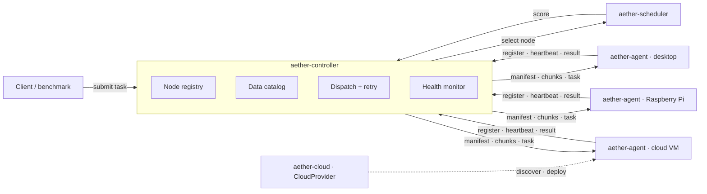

# AetherMesh

**Stop shipping gigabytes to your compute. Ship the compute instead.**

AetherMesh is a Rust layer that sits *on top of* whatever you already run — AWS, GCP, Azure, a VPS, bare metal, the desktop under your desk, a Raspberry Pi — and decides **where each task should run and how few bytes have to move to get it done**.

Write the work in TypeScript, Rust, Go, or anything that compiles to WebAssembly; submit it from Node with a dependency-free SDK. In a 100-task benchmark over a shared 8 MiB dataset, the placement decision is worth **99.9 % less traffic** ([how this is measured](#benchmarks)).

[](https://www.rust-lang.org)
[](#license)
[](#contributing)
[](#project-status)

**[Documentation site](https://syuumaimikan.github.io/AetherMesh/)** · **[日本語](README.ja.md)** · **[Examples](examples)**

---

## The idea

Distributed systems move data to the machine that runs the code. When the data is large and the link is slow, that movement *is* the job's cost — everything else is rounding error.

AetherMesh inverts the default:

```
move data to the compute
        ↓  only when that is actually cheaper
move the compute to the data
```

Four things follow from that principle, and they are what this project is:

| | |
|---|---|
| **Compute optimization** | pick the node by score, not by round-robin |
| **Data locality** | know which node already holds which dataset |
| **Transfer optimization** | content addressing, chunk-level dedup, adaptive compression |
| **Distributed runtime** | registry, heartbeats, dispatch, retries, results |

---

## What makes it different

### Data crosses the wire once

Every dataset is identified by its **BLAKE3 hash**. The controller tracks which node holds what, so a dataset read by a hundred tasks is transferred **once**. Large datasets are split into content-addressed chunks, and a chunk the receiver has already seen — from this dataset or any other — is never sent again.

### Compression is a decision, not a reflex

Payloads under 4 KiB go raw. Links faster than ~800 Mbps are left alone, because there the CPU costs more than the bytes. LZ4 output is kept only if it actually saves ≥ 5 %. Random data does not get pushed through a compressor for nothing.

### A scheduler you can read and tune

```
score = compute_cost + transfer_cost + latency_penalty − locality_bonus
```

Lower wins. Every weight is configurable and the score comes back term by term, so you can see *why* a node was chosen. Three policies ship: `LeastLoadedScheduler`, `LocalityScheduler`, `AdvancedScheduler`.

### Some machines are not interchangeable

Cost decides where work is *cheapest*. Labels decide where it is *allowed*. An agent declares what it is, and a task says what it needs:

```bash
aether-agent --label gpu=true --label region=eu-west
```

```python
mesh.run("hash", payload, constraints=["gpu=true", "region!=us-east"])
```

`key=value`, `key!=value`, and a bare `key` for "has this label at all". Constraints are a filter, not a preference — a task that nothing satisfies waits and reports it rather than landing on a machine that cannot do the job. This is how you keep GPU work off the CPU boxes and regulated data inside its jurisdiction.

### A node can be told how much it is willing to hold

Received datasets are cached so the next task that reads them does not move them again. Left alone, that cache grows for as long as the agent runs — survivable on a workstation, fatal on a board with 1 GB of RAM.

```bash
aether-agent --storage-budget-mb 256
```

Over budget, the least recently used datasets are dropped, and the agent **tells the controller which ones**. That part matters: a catalog that keeps crediting a node with data it threw away keeps sending that node work whose inputs are no longer there. Data already handed to a running task stays alive until the task finishes.

### Urgent work does not wait behind a backlog

Placement decides *where*; a priority queue decides *when*. Five levels, and three rules that fit in a sentence each:

```python
mesh.run("cpu", payload, priority="critical")     # critical · high · normal · low · background
```

Higher priority first. Within one priority, the order they arrived. **And waiting counts**: a task gains a level for every 30 seconds it has spent queued, so a stream of critical work delays background work rather than cancelling it. Without that third rule the lowest priority is not a priority, it is a promise that is never kept.

Measured on one node with 400 background tasks arriving at once: the queue reached a depth of 381, and a critical task submitted 250 ms into the flood finished at position 57 — ahead of every one of the ~340 still waiting, behind only the ~56 that had already run.

### A queue that fills up is a decision, not an accident

Off by default, because a mesh that silently starts refusing work is worse than one that visibly falls behind. When you do want a limit, you choose what gives way:

```toml
max_queue_size = 32
queue_rejection = "reject"        # or drop_oldest, or drop_lowest_priority
queue_timeout_secs = 30
```

`reject` turns the newest away — a submission that comes back is one you can retry or shed. `drop_oldest` is for a live feed, where stale work is worthless whatever it was labelled. `drop_lowest_priority` keeps a full queue full of the work that matters, and refuses anything that is itself the least urgent.

A caller can also set its own deadline: `timeout_ms` on a submission says how long that work is worth waiting for, without changing anything for anyone else.

Whatever happens, the caller is told. Measured on one node, 300 tasks at once:

| | accepted and run | refused | timed out |
|---|---|---|---|
| `max_queue_size = 32` | 42 | **258** | 0 |
| unbounded, `timeout_ms = 200` | 45 | 0 | **255** |

Not one submission was left holding a reply channel that never resolves. That is the part worth having.

### An idle node costs almost nothing to keep

A mesh spends most of its life with nothing to do, and a fixed heartbeat makes that the expensive state: every few seconds, on every machine, a core wakes up to say nothing has changed. So the interval is not fixed. A node running work — or one whose load has visibly moved, even from something the mesh did not start — reports at the configured rate. A node where nothing is happening doubles its gap each time.

The ceiling is the controller's, not the agent's: it declares its eviction window at registration, and the agent stretches to at most half of it, so a single lost heartbeat still cannot evict a healthy node. Raise `heartbeat_timeout_secs` and idle nodes get quieter on their own.

### Failures are ordinary

Heartbeats stop → the node is evicted and its data locations are forgotten. A node refuses a task → the task is re-dispatched to the next best node, data and all. A task that *ran* and failed is returned as a result, not retried forever.

### Your language, someone else's machine

Tasks run as **WebAssembly**, so the work can be written in TypeScript, Rust, Go, C, or anything with a WASM target — and the node still never runs an unsandboxed process. A module gets memory, an input buffer, and a fuel budget. It gets no filesystem, no network, no clock, and no host functions at all.

```ts
const module = await mesh.publishFile("uppercase.wasm");
const result = await mesh.runWasm(module.dataId, new TextEncoder().encode("hello"));
new TextDecoder().decode(result.output); // "HELLO"
```

The module is published like any dataset, so a 5 MB module reaches each node once and the scheduler counts it toward locality. An endless loop costs one task, not the node. Details and per-language build recipes: [`docs/wasm-tasks.md`](docs/wasm-tasks.md).

---

## Project status

**Alpha — everything on the roadmap is implemented, covered by 365 tests, and not yet battle-tested.**

Working today: core types, wire protocol, node registry, metrics collection, three schedulers, label-based placement constraints, TCP transport with TLS and optional mutual TLS on both listeners, shared and per-node tokens, persistent node identity, built-in and WebAssembly task execution with opt-in host capabilities, content-addressed and chunked transfer with dedup, transfer across several parallel connections, adaptive compression, a bounded LRU data cache on each agent, a result cache on the controller, retries and heartbeat eviction, idle heartbeat backoff, measured latency and bandwidth feeding the scheduler, a JSON client API with TypeScript, Python, Go, Java, and C# SDKs, a Prometheus endpoint, a terminal dashboard, TOML configuration, structured logs, cloud adapters for Kubernetes, AWS, GCP, Azure and local processes, and benchmarks against both a naive baseline and Dask.

Honest limits — what is implemented but not proven, rather than missing:

- **The cloud adapters are tested against their HTTP contract, not against the real clouds.** Each one is exercised with a stub server that checks the request it sends and the response it parses; nobody has run them against a live AWS or GKE account from this repository. Expect to hit the details a real account teaches you.
- **WASM capabilities are off by default.** A module can read the datasets the task declared; a clock, randomness, and logging are grants an operator makes deliberately. There is still no filesystem and no network, and there is not going to be.
- **Percentile numbers come from loopback.** The Dask comparison and the internal benchmark both run on one machine.
- **Nothing verifies a label.** An agent claiming `gpu=true` on a machine without one will be sent GPU work and will fail it. Labels route work; they do not audit hardware.
- **No formal security review.** Mutual TLS, constant-time token comparison, and a sandbox with no host access are the design; a review is not the same as a design. An internal pass found and fixed three real issues — data-channel hijacking, heartbeat spoofing, and a non-cryptographic `random` — which is a reason to expect a fourth, not to assume there is none.

---

## Quick start

Requires Rust 1.85+ (edition 2024).

```bash
git clone https://github.com/syuumaimikan/AetherMesh && cd AetherMesh && cargo build --release
```

Start a controller:

```bash
cargo run -p aether-controller -- --listen 127.0.0.1:7000
```

Join a node from any machine that can reach it:

```bash
cargo run -p aether-agent -- --controller 127.0.0.1:7000 --heartbeat-secs 5
```

```
INFO aether_controller: controller listening addr=127.0.0.1:7000 auth=false tls=false
INFO aether_controller::server: node registered node_id=9c5e43a0-… hostname=syuum
```

Submit work from Node — no npm install, no build step on Node 22.6+:

```bash
cargo run -p aether-wasm --example wat2wasm -- examples/wasm/uppercase.wat uppercase.wasm
node sdk/typescript/examples/wasm.ts uppercase.wasm "hello from typescript"
```

```
module 58e46fef2361318a… (233 bytes)
output: HELLO FROM TYPESCRIPT
ran on aebf4c04 in 2.02 ms
```

See the whole dispatch path with no network at all:

```bash
cargo run -p aether-controller --example dispatch_simulation
```

Three real machines — desktop, Raspberry Pi, cloud VM — are covered in [`docs/multi-node.md`](docs/multi-node.md).

---

## Secure it before it leaves your LAN

TLS and authentication are behind the `tls` feature. Generate a certificate, then point both sides at it:

```bash
cargo run -p aether-controller --features tls -- generate-cert --host mesh.example.com
```

```bash
cargo run -p aether-controller --features tls -- --config controller.toml
```

```bash
cargo run -p aether-agent --features tls -- --controller mesh.example.com:7000 --tls-ca cert.pem
```

The token can come from `AETHERMESH_TOKEN` instead of the config file. Full annotated examples: [`examples/controller.toml`](examples/controller.toml) and [`examples/agent.toml`](examples/agent.toml).

```toml
# controller.toml
listen = "0.0.0.0:7000"
auth_token = "change-me"
tls_cert_path = "cert.pem"
tls_key_path = "key.pem"
heartbeat_timeout_secs = 30
```

Registration is refused — and counted — when the token is missing or wrong. Without TLS the token crosses the wire in the clear, and the controller says so at startup.

---

## Watching it run

```bash
cargo install --path crates/aether-tui
aether-tui --controller 127.0.0.1:7100
```

```
 AetherMesh ● live  127.0.0.1:7100  every 1.00s
┌ Throughput ────────────────────────────┐┌ Not moved ─────────────────────────┐┌ Mesh ──────────────────────────────┐
│7.3 MiB/s   peak 7.3 MiB/s              ││compressed away   1020.0 KiB        ││nodes             2/2 connected     │
│18.0 MiB on the wire so far             ││ratio             0.948             ││datasets          26 · 41.0 MiB     │
│ █                                      ││transfers skipped 2                 ││tasks ok          9                 │
│ █                                      ││chunks skipped    3                 ││tasks failed      0                 │
└────────────────────────────────────────┘└────────────────────────────────────┘└────────────────────────────────────┘
┌ Nodes (2) ─────────────────────────────────────────────────────────────────────────────────────────────────────────┐
│   host                     id        cpu    mem    rtt       link         holds            labels                  │
│●  syuum                    73ef9fd1  24%    80%    —         —            2 · 5.0 MiB      kind=gpu                │
│●  syuum                    824d28e0  24%    80%    —         —            —                kind=cpu region=eu-west │
└────────────────────────────────────────────────────────────────────────────────────────────────────────────────────┘
 q quit   s send a task   ↑↓ node   +/- poll rate   r refresh   ? help
```

A real frame from a real mesh. Under load the Mesh panel reads `queued 157 · oldest 1.5s`. The **Not moved** panel is the point of the project; the **holds** column is the locality the scheduler is deciding on. Press `s` to send a task and watch where it lands. Details: [`crates/aether-tui`](crates/aether-tui).

### Or scrape it


```bash
aether-controller --metrics-listen 127.0.0.1:9100
curl 127.0.0.1:9100/metrics
```

```
aethermesh_nodes_registered_total 1
aethermesh_heartbeats_total 1
aethermesh_tasks_completed_total 0
# TYPE aethermesh_nodes gauge
aethermesh_nodes 1
aethermesh_nodes_connected 1
aethermesh_cpu_usage_mean 0.007223892025649548
```

Prometheus text on `/metrics`, a liveness check on `/healthz`. It is off unless you ask for it, and it reports counters and averages only — no hostnames, ids, or addresses, because an unauthenticated port should not double as an inventory of your network. Bind it to localhost anyway.

---

## Architecture



| Crate | Role |
|---|---|
| `aether-core` | Shared types: ids, nodes, tasks, data descriptors, store, chunking, compression. No I/O. |
| `aether-protocol` | Wire messages, bincode encoding, length-prefixed async framing. Transport-independent. |
| `aether-scheduler` | `Scheduler` trait, data catalog, three placement policies. |
| `aether-controller` | Registry, connections, dispatch, retries, health, server (TCP/TLS), simulated mesh. |
| `aether-agent` | Worker: identity, registration, metrics, data store, built-in task execution. |
| `aether-wasm` | Sandboxed WebAssembly execution, on `wasmi` (default) or `wasmtime`. |
| `aether-cloud` | `CloudProvider` adapters: Kubernetes, AWS EC2, GCP Compute, Azure VMs, local processes. |
| `aether-benchmark` | Baseline-vs-AetherMesh measurement with JSON output. |
| `sdk/typescript`, `sdk/python`, `sdk/go` | Dependency-free clients: publish, submit, run WASM. |

---

## Benchmarks

### Against Dask

[Dask distributed](https://distributed.dask.org) is the closest widely used system to compare against: a scheduler, workers, tasks that carry data.

```bash
python -m pip install "dask[distributed]"
cargo build --release -p aether-controller -p aether-agent
python bench/comparison/compare.py --tasks 100 --workers 3
```

100 tasks, 3 workers, one 16-core machine, loopback:

| system | workload | tasks/s | wall ms | p50 ms | p99 ms |
|---|---|---:|---:|---:|---:|
| **aethermesh** | overhead | **5,503** | 18 | **0.17** | **0.26** |
| dask | overhead | 63 | 1,582 | 15.39 | 39.09 |
| **aethermesh** | dataset (8 MiB) | **402** | 249 | **1.67** | **2.47** |
| dask-scatter | dataset (8 MiB) | 31 | 3,232 | 30.86 | 46.18 |
| dask-naive | dataset (8 MiB) | 21 | 4,699 | 40.39 | 87.56 |

`dask-naive` closes over the dataset, so a copy travels with every task. `dask-scatter` calls `client.scatter(..., broadcast=True)` first, which is the idiomatic fix. **AetherMesh behaves like the scatter case without being asked.**

**What this does not show.** The task bodies are not identical — Dask runs a Python callable hashing with `hashlib.blake2b`, AetherMesh runs its Rust BLAKE3 built-in — so the dataset rows mix framework cost with a language difference, and the **overhead row is the fair framework-to-framework number**. Dask also does far more than AetherMesh: arbitrary Python callables, task graphs, dataframes, spilling, a dashboard. And this is loopback on one machine, not a network. Methodology and full caveats: [`docs/benchmarks.md`](docs/benchmarks.md).

### On real sockets

Everything above and below runs a mesh inside one process. This one connects to a controller that is actually running, as an ordinary client, and measures what crossed the wire:

```bash
cargo run -p aether-benchmark -- network --tasks 20 --dataset-bytes 4194304
```

```
2 node(s):
  syuum            127.0.0.1:7001         16 cores · rtt 0.3 ms · link unmeasured
  syuum            127.0.0.1:7002         16 cores · rtt 0.1 ms · link unmeasured

  Every node is on loopback. This measures the software, not a network:
  the transfer saving is real, the latency and bandwidth are not.

20 tasks over a 4.0 MiB dataset (seed 1787032028481393700)

                         naive    aethermesh
  bytes sent          80.0 MiB       4.0 MiB
  wall clock            706 ms         37 ms
  sends skipped              0            19

  traffic reduction: 95.0 %
```

The naive side publishes a fresh copy per task, which is what a system that ships data to code does. AetherMesh publishes once: 19 of 20 tasks found the data already there, and the one that did not is the 5 % that remains.

**Pointing this at real machines needs no code change**, only a different address — everything goes through the client API any program would use. Declare the mesh you mean to measure and it refuses to report a number from a different one:

```bash
cargo run -p aether-benchmark -- network --nodes-config bench/nodes.toml
```
```
Error: expected 3 node(s) but the mesh has 2; a result measured on a
different mesh is not the result you asked for
```

Every report ends with the command that reproduces it, seed included, because the seed deliberately is not fixed — the nodes remember what they have been sent, so repeating one measures a mesh that already holds everything. Rerunning that command against a restarted mesh reproduced 80.0 MiB / 4.0 MiB / 95.0 % exactly.

The report also carries the environment it came from — nodes, addresses, measured latency, client CPU count, OS — and says plainly when every node is on loopback. Full procedure, including the three-machine case: [`docs/benchmarks.md`](docs/benchmarks.md).

### Against a naive dispatcher

```bash
cargo run -p aether-benchmark -- compare --tasks 100 --nodes 3 --kind hash --dataset-bytes 8388608
```

100 tasks across 3 nodes, each reading the same 8 MiB dataset, on a simulated 10 MB/s link:

| Metric | Baseline | AetherMesh |
|---|---:|---:|
| Bytes on the wire | 839,291,600 | **477,569** |
| Traffic reduction | — | **99.9 %** |
| Execution time | 71,173 ms | **404 ms** |
| Speedup | — | **176×** |
| P50 / P95 / P99 latency | 708 / 743 / 750 ms | **2.8 / 2.9 / 3.0 ms** |

**How to read this.** *Baseline* is the same binary with every optimization off — no dedup, no chunking, no compression, load-only scheduling — i.e. it re-sends the dataset for every task, which is what a naive dispatcher does. Both sides run in-process through the real message encoding and the real task executor, so the numbers isolate the optimization layer; they are **not** measurements of network hardware. The gap collapses when tasks share no data: run `--dataset-bytes 0` to see that floor for yourself.

JSON for CI or dashboards:

```bash
cargo run -p aether-benchmark -- compare --format json --output report.json
```

---

## Speaking to it from any language

The controller exposes a second listener for clients: four bytes of big-endian length, then one JSON object, both directions. Five message types cover everything — `hello`, `publish`, `submit`, `nodes`, and the responses.

```json
{"type":"submit","kind":"wasm","module":"58e46f…","payload":"aGVsbG8="}
{"type":"result","success":true,"output":"SEVMTE8=","node_id":"aebf4c04…","duration_ms":2.02}
```

That is a couple of hundred lines in any language with a socket — which is exactly what the SDKs are. **None of them has a runtime dependency**, not even a JSON library where the standard library lacks one.

| SDK | Needs | Notes |
|---|---|---|
| [TypeScript / JavaScript](sdk/typescript) | Node 20+ | the reference implementation |
| [Python](sdk/python) | 3.10+ | also a `concurrent.futures` pool — see [`MeshExecutor`](examples/10-executor) |
| [Go](sdk/go) | 1.21+ | standard library only |
| [Java](sdk/java) | 17+ | two files, no build tool required |
| [C# / .NET](sdk/dotnet) | 8+ | `async` throughout, `IAsyncDisposable` |

```python
# sdk/python
with AetherMesh.connect(port=7100) as mesh:
    data = mesh.publish(open("input.bin", "rb").read())
    result = mesh.run("hash", b"seed", inputs=[data.data_id])
```

```ts
// sdk/typescript
const mesh = await AetherMesh.connect({ port: 7100, token: process.env.AETHERMESH_TOKEN });
const dataset = await mesh.publish(bigBuffer);          // moved once, reused after
const result = await mesh.run("hash", seed, [dataset.dataId]);
```

```go
// sdk/go
mesh, _ := aethermesh.Connect(aethermesh.Options{Port: 7100})
data, _ := mesh.Publish(payload)
result, _ := mesh.Run("hash", []byte("seed"), []string{data.DataID})
```

```java
// sdk/java
try (AetherMesh mesh = AetherMesh.connect(new AetherMesh.Options().port(7100))) {
    var data = mesh.publish(payload);
    var result = mesh.run("hash", "seed".getBytes(), List.of(data.dataId()), List.of());
}
```

```csharp
// sdk/dotnet
await using var mesh = await MeshClient.ConnectAsync(new MeshOptions { Port = 7100 });
var data = await mesh.PublishAsync(payload);
var result = await mesh.RunAsync("hash", "seed"u8.ToArray(), inputs: [data.DataId]);
```

Your language is not here? The protocol above is the whole specification, and every SDK is a single file you can read in one sitting.

---

## Using it as a library

```rust
use aether_controller::{Controller, MeshState, NetworkTransport, RetryPolicy, bind, serve};
use aether_core::{Task, task::kind};
use aether_scheduler::AdvancedScheduler;

let state = MeshState::new();
let (listener, _addr) = bind("0.0.0.0:7000".parse()?).await?;
tokio::spawn(serve(listener, state.clone(), Default::default()));

let mut controller = Controller::new(
    AdvancedScheduler::new(state.catalog.clone()),
    NetworkTransport::new(state.connections.clone()),
    state.catalog.clone(),
)
.with_retry(RetryPolicy::default());

// Publish once — it reaches only the nodes that actually need it.
let dataset = controller.publish(std::fs::read("input.bin")?);

let task = Task::new(kind::HASH, Vec::new()).with_inputs(vec![dataset.id]);
let result = controller.submit(task).await?;
println!("{:?} in {:?}", result.output(), result.duration);
```

---

## Roadmap

Built and tested:

| Area | What is there |
|---|---|
| **Placement** | Least-loaded, data-locality, and scored schedulers; label constraints; measured latency and bandwidth |
| **Data movement** | BLAKE3 content addressing, chunk-level dedup, adaptive LZ4, transfer across several connections |
| **Caching** | Bounded LRU store on each agent with eviction reported to the controller; result cache keyed by work identity |
| **Isolation** | WebAssembly on wasmi or wasmtime, fuel and memory limits, capabilities off by default |
| **Failure** | Heartbeat eviction, retry onto another node, dead sockets skipped at selection |
| **Security** | TLS and mutual TLS on both listeners, shared and per-node tokens, per-registration data-channel tokens, constant-time comparison |
| **Operating it** | TOML config, structured logs, Prometheus `/metrics`, a terminal dashboard, idle heartbeat backoff, small binaries |
| **Reaching it** | JSON client API with TypeScript, Python, Go, Java, and C# SDKs, plus a `concurrent.futures` pool for Python |
| **Provisioning** | Kubernetes, AWS EC2, GCP Compute, Azure VMs, local processes |

What comes next, and where help is most welcome:

- [ ] **Running any of this on real hardware over a real network.** This is the weakest claim in the repository — every number here comes from loopback.
- [ ] Running the cloud adapters against real accounts and fixing what that teaches
- [ ] A security review of the sandbox and the credential paths by someone who did not write them
- [ ] Task priorities and queueing; placement is first-come, first-served today
- [ ] QUIC transport — the framing layer is already transport-independent
- [ ] Scheduling across regions with cost as a term in the score

---

## Design principles

```
Correctness → Simplicity → Performance → Extensibility
```

- `#![forbid(unsafe_code)]` across the workspace.
- No `unwrap()` outside tests; every failure is a `thiserror` type.
- A dependency arrives when something needs it, never before. The whole tree: tokio, serde, bincode, blake3, lz4_flex, sysinfo, clap, tracing, toml, base64, getrandom, wasmi — plus rustls only if you enable `tls`, and wasmtime only if you ask for the JIT.
- Pure-Rust crypto and compression, so a Raspberry Pi cross-build needs no C toolchain.
- `main` stays green: `cargo fmt --check`, `clippy -D warnings`, and the full test suite on Linux, Windows, and macOS.

```bash
cargo test --workspace
cargo test --workspace --features aether-controller/tls,aether-agent/tls,aether-cloud/cloud-http
cargo test -p aether-wasm --no-default-features --features wasmtime-backend
```

Features are opt-in so a small target pays for nothing it does not use: `tls`
(rustls), `cloud-http` (the provider adapters), `wasm` / `wasm-jit` (interpreter
or JIT).

---

## Contributing

Issues and pull requests are welcome — the "what comes next" list above is the shortest path to something worth depending on. Keep changes focused, add tests, and run this before opening a PR:

```bash
cargo fmt --all --check && cargo clippy --workspace --all-targets -- -D warnings && cargo test --workspace
```

The longer version — what a good change looks like here, how the tests are named, what the commit messages are for — is in [`CONTRIBUTING.md`](CONTRIBUTING.md). Security problems go to [`SECURITY.md`](SECURITY.md) instead of the issue tracker.

---

## License

Dual-licensed under either of

- Apache License, Version 2.0 ([`LICENSE-APACHE`](LICENSE-APACHE))
- MIT license ([`LICENSE-MIT`](LICENSE-MIT))

at your option. Unless you state otherwise, any contribution you intentionally submit for inclusion is dual-licensed the same way, with no additional terms.

---

## 日本語

日本語の完全なドキュメントは **[README.ja.md](README.ja.md)** にあります（設計・使い方・ベンチマークの読み方・既知の限界まで）。

関連ドキュメント:

- 3 台構成（PC / Raspberry Pi / クラウド VM）: [`docs/multi-node.md`](docs/multi-node.md)
- WASM タスクの書き方（Rust / AssemblyScript / TinyGo）: [`docs/wasm-tasks.md`](docs/wasm-tasks.md)
- ベンチマークの方法論と注意点: [`docs/benchmarks.md`](docs/benchmarks.md)
